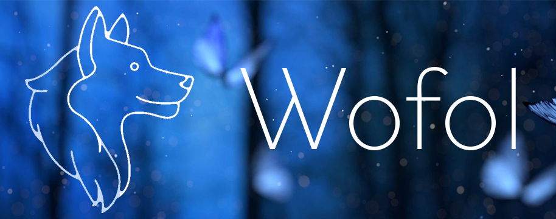

# Wofol

Wofol (*woe-foe*) (a portmanteau of "web portfolio") is a highly customizable, interactive portfolio template / creation tool. It aims to [turn simple markdown into beautiful webpages](#how-simple), so you can create portfolio entries *fast* and without having to worry about things like responsiveness and user accessibility. 

It was initially created in 20 days (11.11.21 - 11.30.21) for the month-long [Mines Sporediggers hackathon](https://sporediggers.spore.build/). 

## Background
[\[Skip Background\]](#features)

Given that I've already had quite a bit of experience with NodeJS through past projects such as [OpenVUE](https://github.com/Ryan778/OpenVUE) and [OpenTrivia](https://github.com/Ryan778/OpenTrivia), I wanted to use this hackathon to try several new things. This hackathon is my first time using: 
- A CSS Processor (SCSS)
- The Jamstack architecture (Zola, Rust based)
- Server-side templates in general (Tera, part of Zola)

I'm quite happy with the result, and plan on using Wofol for my own, personal CS portfolio at some point in the future. 

### Why Static? 
Wofol's build pages require no server-side logic and all dynamic functionally is run client side. 

This was done to make serving/hosting these pages as simple as possible. You can find free static page hosting in all sorts of places now, and Wofol's output can be easily incorporated into a full-stack server if you want to add additional functionality. 

For example, you could
- Use [Cloudflare Pages + Workers](https://blog.cloudflare.com/cloudflare-pages-goes-full-stack/) to add routing middleware only to specific pages (i.e., password protection, access control)
- Serve the build directory as a [static folder using ExpressJS](https://expressjs.com/en/starter/static-files.html), giving you the full power of NodeJS for additional backend logic
- And more! It's all up to your imagination. 

## Features
This list is taken from the [Wofol Demo Website](https://wofol.pages.dev). Visit the demo site for more information!

- Hosting multiple (unlimited, actually) portfolios on one site
  - i.e., separate your work portfolio from a personal art portfolio
- Writing portfolio entires in Markdown with minimal code
- The flexibility to still add HTML/CSS/JS directly for complete customizability
- Lightbox images, inline music players, and more plugins!
  - The music player comes with a visualizer too! Try it out on the [dynamic feature demonstration page](https://wofol.pages.dev/portfolio/wofol/dynamic/#music-player).
- Being **fully responsive** &ndash; works great on mobile, tablet, and desktop!

Again, visit the [Wofol Demo Website](https://wofol.pages.dev) for more details on what's in Wofol, documentation examples, and to see live examples - built using Wofol itself!

## Technical Features
This section goes into the more technical aspects of what Wofol uses and what parts are unique to Wofol (and not from an external library). 

Wofol features
- Minimal dependencies: 
  - The Lightbox plugin requires jQuery, but nothing else does. 
  - Other than the Lightbox plugin, everything else is my own code and **use no external/third party CSS or JavaScript libraries**. 
- Iconography: Google's [Material Icons](https://fonts.google.com/icons) are used as they're free and open source, lightweight, and extremely flexible. 
- Powered by Zola: 
  - Zola is the static site generator (SSG) used to build pages. It's available as a dependency free, [standalone binary](https://www.getzola.org/documentation/getting-started/installation/) and is powered by Rust. 
  - All interactive features are powered by native JavaScript (*not* Rust), as Rust is only used for SCSS compilation and templating. 
- Plugins (written by me and dependency free *except for Lightbox*): 
  - 3dCards: Makes portfolio cards fancy by giving them a "raised card" effect when you hover your mouse over them. 
  - MusicPlayer: Adds a feature-packed music player to play audio files, falling back to the default browser-based implementation if disabled. Features an audio visualizer!
  - Folders: Separate images (or anything else!) by class, and allow users to switch between "folders". 
  - Lightbox: Modified from [Dhakar's Lightbox2](https://lokeshdhakar.com/projects/lightbox2/) to fit the design style of Wofol, this is the only plugin that relies on an external library. 
    - Dependency: jQuery v1.x.x

### How Simple? 
Portfolio pages can be as simple or as fancy as you want them to be. 

Check out the following example pages and the markdown that was used to create them below: 

| Example | Source | Result |
| - | - | - |
| Basic blog post (almost all plaintext) | [blog-post.md](content/portfolio/demo/blog-post.md) | [.../blog-post/](https://wofol.pages.dev/portfolio/demo/blog-post/)
| Quizzical (slightly fancier markdown page) | [quizzical/index.md](content/portfolio/demo/quizzical/index.md) | [.../quizzical/](https://wofol.pages.dev/portfolio/demo/quizzical/)|

Note that Quizzical was placed in its own folder. This is useful when you have lots of assets you want to keep separate from the other pages!

For reference, Quizzical is [a previous project of mine](https://github.com/Ryan778/Quizzical). 

## License
Wofol is available under the [MIT License](license.txt). 

## Attribution
Wolf icon by [icongeek26 from Flaticon](https://www.flaticon.com/authors/icongeek26)